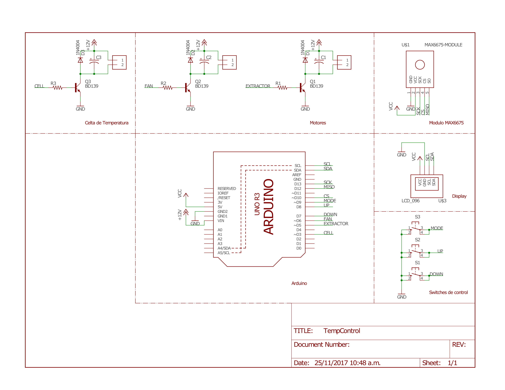
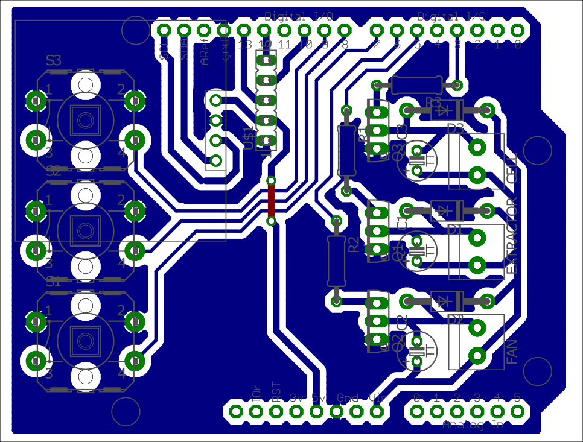

    Novedades:
    [11-25] Ya montamos las primeras imagenes en la Galeria

### Instalación [Pendiente]
 - Instalar El programa de Arduino
 - Descargar el archivo Zip

### Descripción del equipo
El equipo está conformado por dos ventiladores de 12 voltios acoplados a aletas disipadoras de aluminio y cobre (uno de estos, ubicado dentro de un recipiente de espuma de poliestireno), una celda peltier tec-12706, una pantalla de visualización de datos “oled”, un sensor de temperatura tipo termocupla, un integrado Max6675 (ADC), tres botones, tres transistores TIP122 (NPN), un relé y un shield para las conexiones.

### Lista de Materiales (BOM)

| Name         			| Documentación |
|:-------------			|:-----------------|
| Arduino Uno  			| [webpage](https://store.arduino.cc/usa/arduino-uno-rev3)			   | 
| Display Oled 			| [datasheet](http://www.buydisplay.com/download/manual/ER-OLED0.96_Series_Datasheet.pdf)|
| Max6675 	   			| [datasheet](https://cdn-shop.adafruit.com/datasheets/MAX6675.pdf)     |
| Celda Termoelectrica	| [datasheet](http://peltiermodules.com/peltier.datasheet/TEC1-12706.pdf) |

### Galeria [Pendiente]
#### Esquemático

#### Board

#### Videos

### Integrantes
 - David Escalante
 - Jose Lamadrid
 - Aldair Benavides
 - Jose Lopez
 - Tomas Quintero

## Preguntas Frecuentes ##

### Selección de sensores. (error estático y dinámico)
Error de 0.75 en estado transitorio, dado que el aire al interior del contenedor está en constante circulación, por esto la temperatura del contenedor no posee una temperatura totalmente uniforme durante el estado de transición.

RTD vs termopar- RTD superior en la mayoría de aspectos excepto por la robustez, tamaño, velocidad de respuesta y precio.

### Adquisición de datos y acondicionamiento de señal (circuitos de acondicionamiento y elementos asociados a las características del procesador).

Se hace uso de un circuito integrado (Max6675) usado como intermediario entre el sensor (termocupla) y el controlador (arduino uno) para convertir la señal analógica en una señal digital (ADC). El max6675 hace uso de un amplificador, un diodo de compensación (bloque isotermo), buffer de voltaje y un ADC.
El max6675 envía una señal digital al ardiuno, la cual se interpreta por medio de una librería previamente instalada.

### Calibración de sensores, cálculo de errores e incertidumbre.
La calibración del sensor lo hace internamente el arduino, con las librerías internas que están en el, podemos decir lo que esta realizando internamente es lo siguiente, a conocer una de las temperaturas de alguna de las 2 uniones y al hacer la otra unión 0°C, por medio de la ley de temperaturas intermedias y buscando en las tablas conseguir el valor de tensión al que debe estar la termocupla.

# Development
## Links de interés
 - [Theme Template](https://pages-themes.github.io/slate/)
 - [Online Editor](https://stackedit.io/editor#)
 - [Theme Manual](https://github.com/pages-themes/slate)
 - [Jekyll DOC](http://import.jekyllrb.com/docs/home/) 
 - [Themes](http://jekyllthemes.org/)
