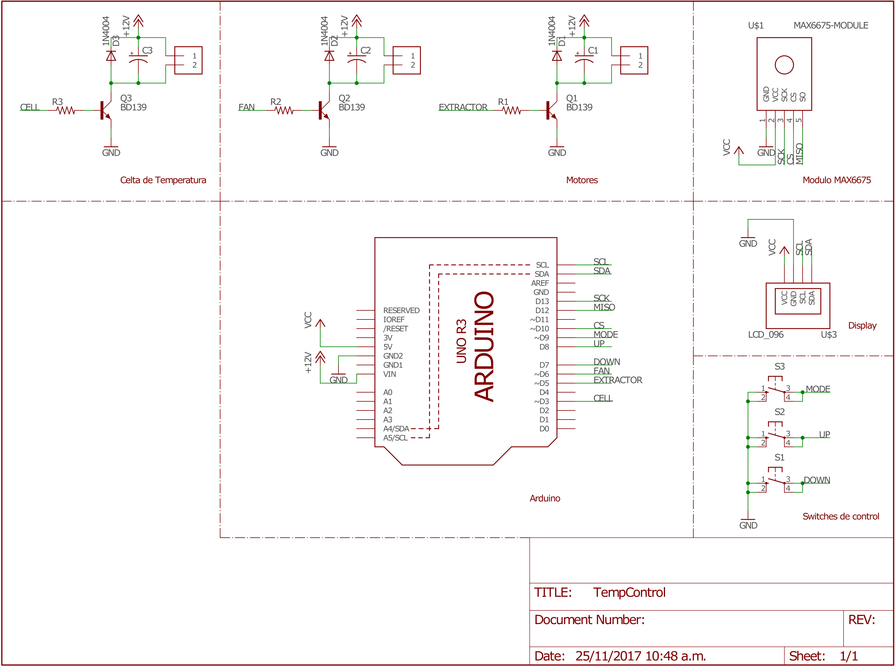

    Novedades:
    [11-25] Ya montamos las primeras imagenes en la Galeria

### Instalación [Pendiente]
 - Instalar El programa de Arduino
 - Descargar el archivo Zip

### Descripción del equipo
Los sistemas de acondicionamiento y refrigeración, son utilizados ampliamente en campos farmacéuticos, químicos e industrias donde se presentan reacciones que dan a condiciones específicas, e incluso en campos que son aparentemente sencillos pero importantes como lo son los alimentos. Es tal la importancia de estos procesos y los avances tecnológicos que suele utilizarse procesos de automatización y control para dichos procesos. 

En el siguiente trabajo se presentó un procesos de refrigeración instrumentando el cual cuenta con el uso de una termocupla tipo k modelo MAX-6675 el cual posee un gran amplio de trabajo comprendido entre 0-1024°C además de 8 pines, además de ser manipulado por el micro controlador de Arduino utilizado el lenguaje de programación libre y el datasheet del sensor para su correcto funcionamiento, todo con el fin de controlar la temperatura en el interior de una cava mediante el uso de células Peltier, para comprobar y corroborar el uso de métodos de refrigeración alternativo implementando los conocimientos de instrumentación industrial.
### Container

### Oled y Shield de arduino

### Disipador interno

### Disipador externo

### Botones y transistores

### Lista de Materiales (BOM)

| Name         			| Documentación |
|:-------------			|:-----------------|
| Arduino Uno  			| [webpage](https://store.arduino.cc/usa/arduino-uno-rev3)			   | 
| Display Oled 			| [datasheet](http://www.buydisplay.com/download/manual/ER-OLED0.96_Series_Datasheet.pdf)|
| Max6675 	   			| [datasheet](https://cdn-shop.adafruit.com/datasheets/MAX6675.pdf)     |
| Celda Termoelectrica	| [datasheet](http://peltiermodules.com/peltier.datasheet/TEC1-12706.pdf) |

### Galeria [Pendiente]
#### Esquemático

#### Board

#### Videos
Prueba del display oled

Prueba del disipador

Prueba de la unidad de enfriamiento

### Integrantes
 - David Escalante
 - Jose Lamadrid
 - Aldair Benavides
 - Jose Lopez
 - Tomas Quintero

## Preguntas Frecuentes ##

### Selección de sensores. (error estático y dinámico)
Error de 0.75 en estado transitorio, dado que el aire al interior del contenedor está en constante circulación, por esto la temperatura del contenedor no posee una temperatura totalmente uniforme durante el estado de transición.

RTD vs termopar- RTD superior en la mayoría de aspectos excepto por la robustez, tamaño, velocidad de respuesta y precio.

### Adquisición de datos y acondicionamiento de señal (circuitos de acondicionamiento y elementos asociados a las características del procesador).

Se hace uso de un circuito integrado (Max6675) usado como intermediario entre el sensor (termocupla) y el controlador (arduino uno) para convertir la señal analógica en una señal digital (ADC). El max6675 hace uso de un amplificador, un diodo de compensación (bloque isotermo), buffer de voltaje y un ADC.
El max6675 envía una señal digital al ardiuno, la cual se interpreta por medio de una librería previamente instalada.

### Calibración de sensores, cálculo de errores e incertidumbre.
La calibración del sensor lo hace internamente el arduino, con las librerías internas que están en el, podemos decir lo que esta realizando internamente es lo siguiente, a conocer una de las temperaturas de alguna de las 2 uniones y al hacer la otra unión 0°C, por medio de la ley de temperaturas intermedias y buscando en las tablas conseguir el valor de tensión al que debe estar la termocupla.

## Anécdotas ##

 1. Durante la fase de pruebas de la unidad de enfriamiento junto con el controlador (arduino), se presento un contratiempo, dado que la celda peltier exige un alto nivel de corriente (4.5 A)  mientras que el transistor restringía el paso de la corriente, la corriente al no poder seguir su camino hacia la celda, Causando una averia en el reculador de voltaje del controlador (arduino).
 2. Al realizar el prototipo del circuito haciendo uso de la protoboard, un par de cables que no estaban completamente aislados, hicieron contacto, de tal forma que se cerro el circuito, sin ninguna resistencia, ocasionando un corto circuito, el cual tuvo como consecuencia una avería catastrófica en el transistor de prueba.

# Development
## Links de interés
 - [Theme Template](https://pages-themes.github.io/slate/)
 - [Online Editor](https://stackedit.io/editor#)
 - [Theme Manual](https://github.com/pages-themes/slate)
 - [Jekyll DOC](http://import.jekyllrb.com/docs/home/) 
 - [Themes](http://jekyllthemes.org/)
